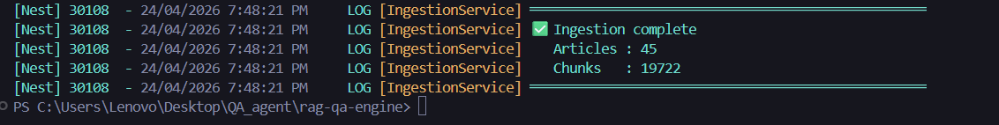
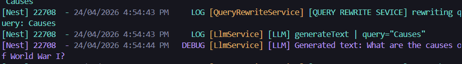

# Symbiote Learning App - RAG-based QA Engine

A sophisticated Retrieval-Augmented Generation (RAG) system designed to provide precise answers based on a curated knowledge base (e.g., WWII history). This project features a robust **NestJS (Fastify)** backend and a modern **Next.js** frontend.
<video src="./rag-qa-engine/images/demo.mp4" controls="controls" style="max-width: 100%;"></video>
## 🚀 Project Overview

The system implements a complete RAG pipeline:
1.  **Data Collection**: Automated gathering of information from Wikipedia via API.
2.  **Ingestion**: Processing, cleaning, and chunking text into structured formats.
3.  **Storage**: High-performance vector storage and hybrid search using **Qdrant**.
4.  **Retrieval**: Advanced hybrid search (Dense Vector + BM25 Sparse) with Query Rewriting.
5.  **Generation**: Real-time streamed responses via LLMs (Groq) with integrated citations.

---

## 🏗 Project Structure

### 1. Backend (`rag-qa-engine`)
- **Framework**: NestJS with Fastify for high-performance networking.
- **Key Features**:
    - **Data Collection Pipeline**: `src/data_collection` - Scrapes and cleans Wikipedia content.
    - **Ingestion Pipeline**: `src/ingestion` - Chunks data and generates embeddings.
    - **Hybrid Search**: Combines semantic meaning with keyword matching.
    - **Session Management**: Tracks conversation history via persistent session IDs.
    - **Vercel AI SDK Integration**: Uses `streamText` for optimized LLM streaming.

### 2. Frontend (`chat_ui`)
- **Framework**: Next.js (React)
- **Key Features**:
    - **Interactive Chat**: A premium UI for engaging with the QA engine.
    - **Real-time Streaming**: "Typing" effect for assistant responses.
    - **Citation View**: Interactive citations that link back to source material.
    - **Responsive Design**: Styled with Tailwind CSS for all devices.

---

## 🛠 Setup Instructions

### 1. Clone the Project
```bash
git clone <repository-url>
cd QA_agent
```

### 2. Install Dependencies
**Backend:**
```bash
cd rag-qa-engine
pnpm install
```

**Frontend:**
```bash
cd ../chat_ui
npm install
```

### 3. Run Qdrant with Docker
Qdrant serves as the vector database. Launch it using Docker:
```bash
docker run -p 6333:6333 -p 6334:6334 qdrant/qdrant
```

### 4. Environment Variables
Create a `.env` file in the `rag-qa-engine` directory:

```env
# API Keys
GROQ_API_KEY=your_groq_api_key_here

# Vector DB
QDRANT_URL=http://localhost:6333

# Models
EMBEDDING_MODEL=Xenova/all-MiniLM-L6-v2
LLM_MODEL=meta-llama/llama-4-scout-17b-16e-instruct
```

---

## 🏃 Execution Flow

### Step 1: Data Collection
Gather raw data from Wikipedia using seed keywords:
```bash
cd rag-qa-engine
pnpm collect_data
```

### Step 2: Data Ingestion
Process the collected data and store it in Qdrant:
```bash
pnpm ingest
```


### Step 3: Start the Backend
```bash
pnpm run start
```

### Step 4: Start the Frontend
In a separate terminal:
```bash
cd chat_ui
npm run dev
```
Access the app at `http://localhost:3000`.

---

## 📝 Core Features

### Data Collection & Ingestion
- **Wikipedia Scraper**: Uses the Wikipedia API to collect data based on seed topics and keywords.
- **Data Cleaning**: Automatically flattens sections, removes noise (e.g., "See Also", "References"), and prepares text for chunking.
- **Structured Ingestion**: Maps data into Qdrant using rich metadata for enhanced filtering.

### Hybrid Search & Retrieval
- **Dense Vector Search**: Captures semantic intent using transformer embeddings.
- **Sparse BM25 Search**: Ensures exact keyword matches for specific terminology.
- **Metadata Filtering**: Uses structured metadata to narrow down search results and provide context.

### Query Rewriting
- Automatically transforms follow-up questions (e.g., "What about the Battle of Midway?") into self-contained search queries based on the conversation history to improve retrieval accuracy.



### Session & History Management
- Uses unique **Session IDs** provided in the request to maintain conversation state.
- Conversation history is managed server-side and sent back to the client to maintain context across multiple turns.

### Streaming & Citations
- **Streamed Responses**: Powered by Vercel AI's `streamText`, providing a low-latency "typing" experience via Server-Sent Events (SSE).
- **Integrated Citations**: After the answer completes, citation metadata is injected into the stream, allowing users to verify facts against the original source knowledge base.
