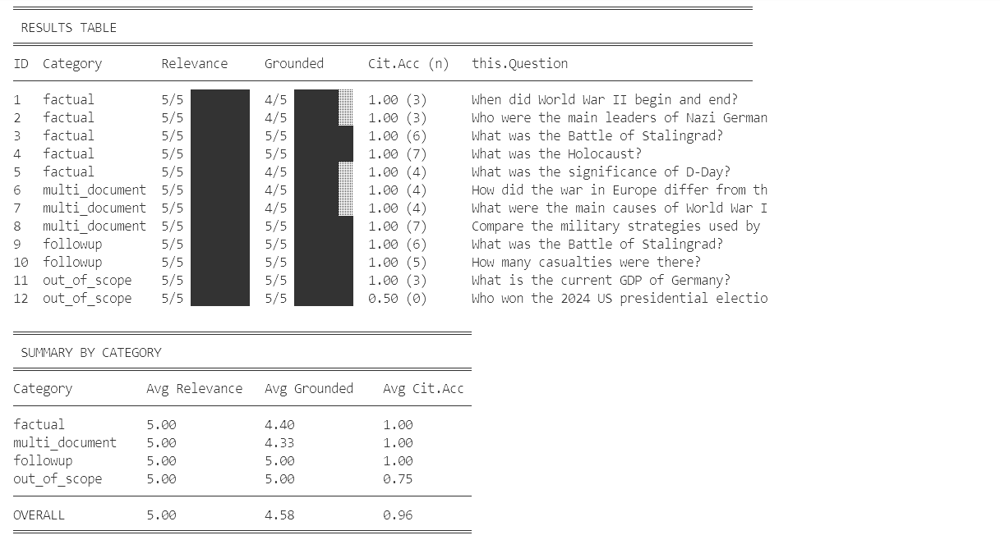

# Symbiote Learning App - RAG-based QA Engine

A sophisticated Retrieval-Augmented Generation (RAG) system designed to provide precise answers based on a curated knowledge base (e.g., WWII history). This project features a robust **NestJS (Fastify)** backend and a modern **Next.js** frontend.
<<<<<<< HEAD


=======
<video src="./rag-qa-engine/images/demo.mp4" controls="controls" style="max-width: 100%;"></video>
>>>>>>> e32fe05 (feat: add evaluation pipeline)
## Project Overview

The system implements a complete RAG pipeline:
1.  **Data Collection**: Automated gathering of information from Wikipedia via API.
2.  **Ingestion**: Processing, cleaning, and chunking text into structured formats.
3.  **Storage**: High-performance vector storage and hybrid search using **Qdrant**.
4.  **Retrieval**: Advanced hybrid search (Dense Vector + BM25 Sparse) with Query Rewriting.
5.  **Generation**: Real-time streamed responses via LLMs (Groq) with integrated citations.
6.  **Evaluation**: Automated pipeline assessment using LLM-as-judge and programmatic metrics.

---

## Project Structure

### 1. Backend (`rag-qa-engine`)
- **Framework**: NestJS with Fastify for high-performance networking.
- **Key Features**:
    - **Data Collection Pipeline**: `src/data_collection` - Scrapes and cleans Wikipedia content.
    - **Ingestion Pipeline**: `src/ingestion` - Chunks data and generates embeddings.
    - **Hybrid Search**: Combines semantic meaning with keyword matching.
    - **Session Management**: Tracks conversation history via persistent session IDs.
    - **Vercel AI SDK Integration**: Uses `streamText` for optimized LLM streaming.
    - **Evaluation Harness**: `src/evaluation` - Measures relevance, groundedness, and citation accuracy.

### 2. Frontend (`chat_ui`)
- **Framework**: Next.js (React)
- **Key Features**:
    - **Interactive Chat**: A premium UI for engaging with the QA engine.
    - **Real-time Streaming**: "Typing" effect for assistant responses.
    - **Citation View**: Interactive citations that link back to source material.
    - **Responsive Design**: Styled with Tailwind CSS for all devices.

---

## Setup Instructions

### 1. Clone the Project
```bash
git clone <repository-url>
cd QA_agent
```

### 2. Install Dependencies
**Backend:**
```bash
cd rag-qa-engine
pnpm install
```

**Frontend:**
```bash
cd ../chat_ui
npm install
```

### 3. Run Qdrant with Docker
Qdrant serves as the vector database. Launch it using Docker:
```bash
docker run -p 6333:6333 -p 6334:6334 qdrant/qdrant
```

### 4. Environment Variables
Create a `.env` file in the `rag-qa-engine` directory:

```env
# API Keys
GROQ_API_KEY=your_groq_api_key_here

# Vector DB
QDRANT_URL=http://localhost:6333

# Models
EMBEDDING_MODEL=Xenova/all-MiniLM-L6-v2
LLM_MODEL=meta-llama/llama-4-scout-17b-16e-instruct

# Evaluation (Optional)
EVAL_API_URL=http://localhost:3002/chat
EVAL_JUDGE_MODEL=meta-llama/llama-4-scout-17b-16e-instruct
EVAL_COLLECTION=wwii_corpus
EVAL_DELAY_MS=600
```

---

## Execution Flow

### Step 1: Data Collection
Gather raw data from Wikipedia using seed keywords:
```bash
cd rag-qa-engine
pnpm collect_data
```

### Step 2: Data Ingestion
Process the collected data and store it in Qdrant:
```bash
pnpm ingest
```


### Step 3: Start the Backend
```bash
pnpm run start
```

### Step 4: Pipeline Evaluation
Assess the performance of the RAG system:
```bash
pnpm evaluate
```
This script runs predefined test cases and returns an evaluation compared against ground truth (evaluation/results).



### Step 5: Start the Frontend
In a separate terminal:
```bash
cd chat_ui
npm run dev
```
Access the app at `http://localhost:3000`.

---

## Core Features

### Data Collection & Ingestion
- **Wikipedia Scraper**: Uses the Wikipedia API to collect data based on seed topics and keywords.
- **Data Cleaning**: Automatically flattens sections, removes noise (e.g., "See Also", "References"), and prepares text for chunking.
- **Structured Ingestion**: Maps data into Qdrant using rich metadata for enhanced filtering.

### Hybrid Search & Retrieval
- **Dense Vector Search**: Captures semantic intent using transformer embeddings.
- **Sparse BM25 Search**: Ensures exact keyword matches for specific terminology.
- **Metadata Filtering**: Uses structured metadata to narrow down search results and provide context.

### Query Rewriting
- Automatically transforms follow-up questions (e.g., "What about the Battle of Midway?") into self-contained search queries based on the conversation history to improve retrieval accuracy.


### Session & History Management
- Uses unique **Session IDs** provided in the request to maintain conversation state.
- Conversation history is managed server-side and sent back to the client to maintain context across multiple turns.

### Streaming & Citations
- **Streamed Responses**: Powered by Vercel AI's `streamText`, providing a low-latency "typing" experience via Server-Sent Events (SSE).
- **Integrated Citations**: After the answer completes, citation metadata is injected into the stream, allowing users to verify facts against the original source knowledge base.

### Evaluation & Metrics
- **Automated Harness**: Runs tests from `src/evaluation/test-cases.json` covering factual, multi-document, and follow-up scenarios.
- **LLM-as-Judge**: Uses a judge LLM to score responses based on **Relevance** and **Groundedness**.
- **Citation Accuracy**: Programmatically verifies if [N] markers match provided citation objects.
- **Performance Tracking**: Calculates average scores per category and saves timestamped results for regression testing.
---

## Technical Design & Rationale

### 1. LLM & Inference Engine: Groq + llama-4-scout-17b-16e-instruct
- **Choice**: High-performance open-source LLMs running on **Groq**.
- **Rationale**: Groq's LPU (Language Processing Unit) provides industry-leading inference speed, which is critical for real-time RAG applications. It is fully compatible with the **Vercel AI SDK**, accelerating development through standardized streaming interfaces and high availability.

### 2. Vector Database: Qdrant
- **Choice**: **Qdrant** Vector Database.
- **Rationale**: Qdrant provides best-in-class, high-performance semantic search with exceptionally low latency. Its advanced, structured **metadata filtering** allows the system to narrow down search spaces before performing vector comparisons, maximizing both performance and efficiency in complex RAG pipelines.

### 3. Embedding Model: Quantized all-MiniLM-L6-v2
- **Choice**: A quantized **ONNX** version of `sentence-transformers/all-MiniLM-L6-v2`.
- **Rationale**: Optimized specifically for JavaScript/Node.js environments via `onnxruntime-node`.
    - **Excellent Semantic Accuracy**: Despite its small size, it provides high-quality sentence embeddings, trained on a massive 1 billion sentence pairs.
    - **Balanced Accuracy vs. Speed**: Offers the perfect middle ground for local execution without sacrificing retrieval quality.

### 4. Chunking Strategy: Structural Alignment
- **Rationale**:
    - **Semantic Preservation**: Chunks are never split mid-section; they respect the natural hierarchy of the document (Intro, Sections).
    - **Paragraph Context**: Smaller paragraphs (under 80 words) are kept as single units to preserve context.
    - **Sentence Precision**: Larger paragraphs are split into sentences to ensure the LLM receives the most relevant "needles" without excessive "haystack" noise.

### 5. Prompt Engineering: Precision & Integrity
- **Rationale**:
    - **Role Alignment**: The prompt establishes a specific persona to steer the model’s output, ensuring clarity and utility. This technique is particularly effective for the MoE (Mixture-of-Experts) architecture of Llama-4-Scout-17B-16E-Instruct, as it helps activate the most relevant "expert" neurons for the specialized task, resulting in higher precision and reduced hallucination.
    -**Instruction Hierarchy & Constraint Layering**: The prompt is structured into clearly separated sections (task, rules, constraints, style), ensuring that higher-priority constraints override stylistic preferences.
     - **Structured Narrative**: Prompts prioritize well-formed paragraphs over simple bullet points to ensure a cohesive, professional research tone.
    - **Explicit failure modes**: Strict "Zero-Hallucination" instructions force the LLM to refuse questions not supported by the retrieved context.
   

### 6. Evaluation Framework: Results Analysis
- **Rationale**: The evaluation harness provides a multi-dimensional view of the RAG pipeline's health:
    - **Relevance**: Measures how effectively the retrieval layer found information that matches the user's intent.
    - **Groundedness**: Analyzes if the LLM's answer is strictly supported by the retrieved snippets (minimizing hallucinations).
    - **Citation Accuracy**: A programmatic check ensuring every citation in the text maps to a real, provided source.
- **Analysis**: Results are categorized (Factual, Multi-document, etc.) to identify specific architectural weaknesses, such as needing better query rewriting for follow-ups or improved hybrid search for cross-document synthesis.
